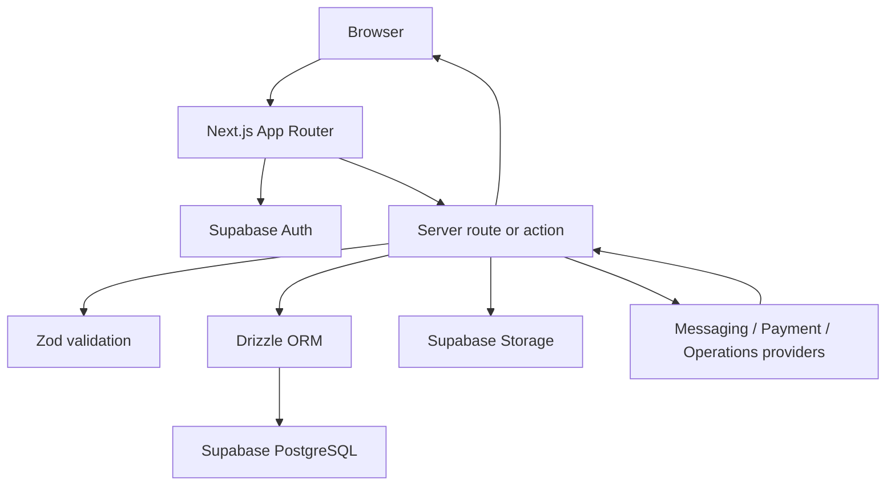

# Architecture

## Purpose

Self Portrait Studio is an operations application built around three connected
business subsystems:

1. **Booking & Reservation** — availability, reservations, reservation
   lifecycle, customer/guest details, and reservation history.
2. **Point of Sale (POS) & Billing** — orders, line items, billing, payments,
   receipts, and payment lifecycle.
3. **Inventory & Supply Management** — items, stock levels, suppliers, stock
   movements, and replenishment workflows.

The application is intentionally split between a browser-facing UI, trusted
Next.js server code, Supabase services, and server-only provider integrations.
The subsystem boundary is a business boundary, not a security boundary: all
cross-subsystem changes must remain transactional where the domain requires it
and must be authorized server-side.

## Stack and responsibilities

| Layer            | Technology                        | Responsibility                                                        |
| ---------------- | --------------------------------- | --------------------------------------------------------------------- |
| Application      | Next.js App Router                | UI, route handlers, server-side orchestration, and request boundaries |
| UI system        | Tailwind CSS + shadcn/ui          | Accessible, reusable presentation components                          |
| Auth and storage | Supabase Auth + Storage           | Session identity and restricted operational documents/assets          |
| Database         | Supabase PostgreSQL               | Persistent application data, constraints, and access control          |
| Data access      | Drizzle ORM + postgres.js         | Typed schema, server-side queries, and migrations                     |
| Validation       | Zod + drizzle-zod                 | Input validation and schemas derived from database tables             |
| Providers        | Botcake, payment service, Contavo | Messaging, payments, and external operational workflows               |
| Deployment       | AWS (planned)                     | Runtime hosting and operational infrastructure                        |

## Subsystem boundaries

### Booking & Reservation

This subsystem owns availability and reservation state. Future data models
should make overbooking impossible through database constraints or a
transactional availability workflow. Reservation status transitions must be
validated; do not permit a client to set an arbitrary status.

### Point of Sale (POS) & Billing

This subsystem owns the financial record of orders, bill totals, payment state,
and receipts. Monetary values must use integer minor units or a fixed-precision
numeric type — never floating-point values. Payment-provider responses are not
authoritative until a signed webhook is verified and recorded idempotently.

### Inventory & Supply Management

This subsystem owns catalogued stock, suppliers, receiving, adjustments, and
stock movement history. Current quantity must be derived or updated
transactionally alongside an immutable movement/audit record. Do not permit a
client to overwrite stock counts without recording the reason and actor.

### Cross-subsystem rules

- A booking, bill, or inventory record may reference another subsystem only via
  a defined database relation or domain operation; do not couple pages through
  client-side state.
- A completed payment, reservation cancellation, fulfilment, or stock
  adjustment may affect other subsystems. Define the order of operations,
  transaction boundary, retry behavior, and compensating action before coding.
- Financial and inventory changes require immutable audit data: actor, time,
  source operation, previous value where appropriate, and resulting value.
- Do not delete finalized financial, stock-movement, or audit records. Prefer
  status transitions, reversals, or correction records.

## Directory map

```text
src/
├── app/                    # App Router pages, layouts, and route handlers
│   └── api/health/          # Liveness endpoint
├── components/ui/           # shadcn/ui primitives
├── db/
│   ├── schema.ts            # Drizzle table, enum, and Zod schema definitions
│   └── index.ts             # Server-only Drizzle database client
└── lib/
    ├── client.ts            # Supabase browser client from the Supabase block
    ├── server.ts            # Supabase server client from the Supabase block
    ├── middleware.ts        # Session-refresh helper from the Supabase block
    ├── supabase/            # Existing Supabase client helpers
    └── integrations/        # Server-only external-provider configuration

docs/                       # Architecture, agent guidance, and prompt template
prompt/                     # Reusable prompts for AI-assisted development work
drizzle.config.ts            # Drizzle Kit configuration
```

Create feature modules and routes by subsystem as implementation begins. Share
only intentionally generic code (auth, UI primitives, validation helpers, and
integration infrastructure).

## Request and data flow



1. The browser authenticates with the Supabase browser client using only the URL
   and publishable key.
2. Server code determines the authenticated user with the server-side Supabase
   client. Never trust a user ID, role, price, or quantity sent by the browser.
3. Zod validates client input, route parameters, webhook payloads, and provider
   responses at their server boundary.
4. Drizzle reads and writes PostgreSQL. It is server-only and uses
   `DATABASE_URL`, never a browser-visible variable.
5. Server-only provider clients execute signed payment, messaging, and other
   external requests using non-public environment variables.

## Current implementation state

The current Drizzle schema is an initial bootstrap and contains `profiles` plus
portrait-oriented `portraits` records. It **does not yet model** the three
business subsystems. Before implementing subsystem features, replace or migrate
that placeholder schema into reviewed domain tables, constraints, indexes, RLS
policies, and audit structures. Do not adapt the `portraits` table to represent
reservations, bills, or inventory.

`updated_at` currently has a default for inserts only. Add a database trigger or
set it in each update path before relying on it as a last-modified timestamp.

## Authentication and access model

The initial schema defines tables only; migrations and Row Level Security
policies must be added before client-side access is enabled. Policies must
reflect the actual business role and ownership/tenant model. A policy for an
update must include both `USING` and `WITH CHECK` predicates. Treat Storage
object paths and operational documents as user data and apply equivalent access
controls to Storage policies.

## Supabase client convention

The Supabase shadcn block provides `src/lib/client.ts`, `src/lib/server.ts`,
and `src/lib/middleware.ts`; prefer these helpers in new routes and components.
`src/lib/supabase/` contains existing equivalent helpers from the initial
scaffold. Do not mix both patterns in one feature. Consolidate callers onto one
set before removing the unused set.

## Integration boundary

`src/lib/integrations/contracts.ts` only resolves typed configuration today.
Provider-specific clients should live beside it and expose narrow domain
operations (for example, `createPayment`, `verifyPaymentWebhook`, or
`sendReservationNotification`). Route handlers must validate webhook signatures
against raw request bodies, make idempotency explicit, and avoid persisting
provider secrets or raw sensitive payloads.
